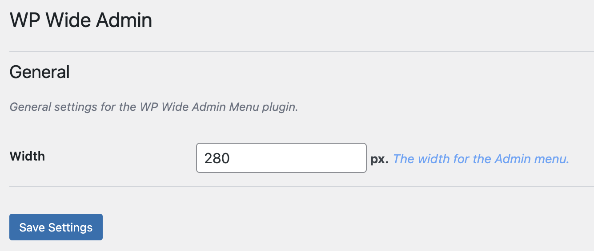

# Wide Admin Menu

Contributors: rhaseventh
Tags: admin, menu, width, customize
Requires at least: 4.7
Tested up to: 6.6
Stable tag: 1.0.1
Requires PHP: 7.0
License: GPLv2 or later
License URI: https://www.gnu.org/licenses/gpl-2.0.html

The Wide Admin Menu plugin allows you to customize the width of the WordPress admin menu.

## Description

The **Wide Admin Menu** plugin allows you to customize the width of the WordPress admin menu. This can be particularly useful for users who need more space for menu items or prefer a wider layout.

## Features

- Customize the width of the WordPress admin menu.
- Simple and intuitive interface.
- Easy to install and configure.

## Installation

1. **Upload the plugin files to the `/wp-content/plugins/wp-wide-admin-menu` directory**, or install the plugin through the WordPress plugins screen directly.
2. **Activate the plugin** through the 'Plugins' screen in WordPress.
3. **Navigate to the plugin settings page** to configure the width of the admin menu.

## Usage

1. Go to `Settings > Wide Admin Menu` in the WordPress admin menu.
2. Adjust the width of the admin menu using the provided input field.
3. Click `Save` to apply the changes.

## Screenshots

1. **Settings Page:**
   

## Frequently Asked Questions

### How do I change the width of the admin menu?

Navigate to `Settings > Wide Admin Menu`, adjust the width using the input field, and click `Save`.

### What is the minimum and maximum width I can set?

You can set the width between 100px and 500px.

## Credits

This plugin uses the [Mustache](https://github.com/bobthecow/mustache.php) and the [Smarty](https://www.smarty.net/) templating engines and the [TailwindCSS](https://tailwindcss.com/) CSS framework.

## License

This plugin is licensed under the GPLv2 or later. For more information, see the [LICENSE](LICENSE) file.
